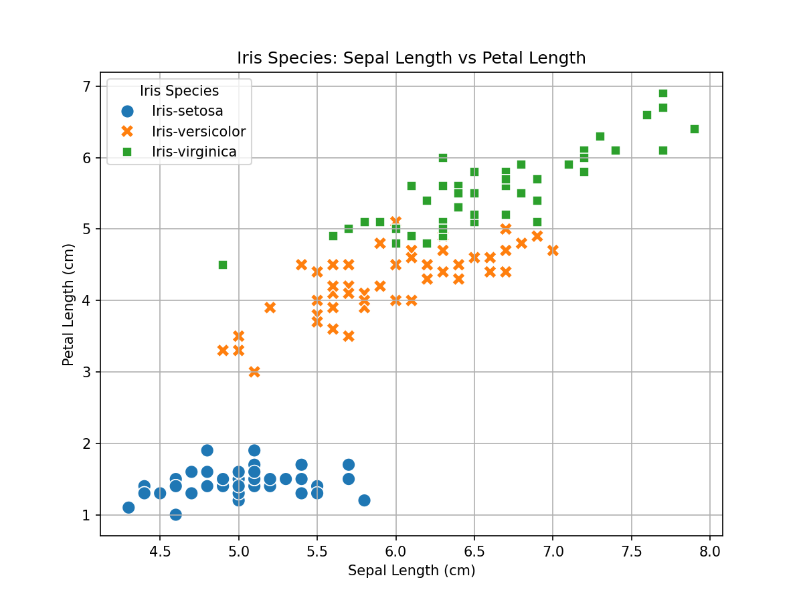
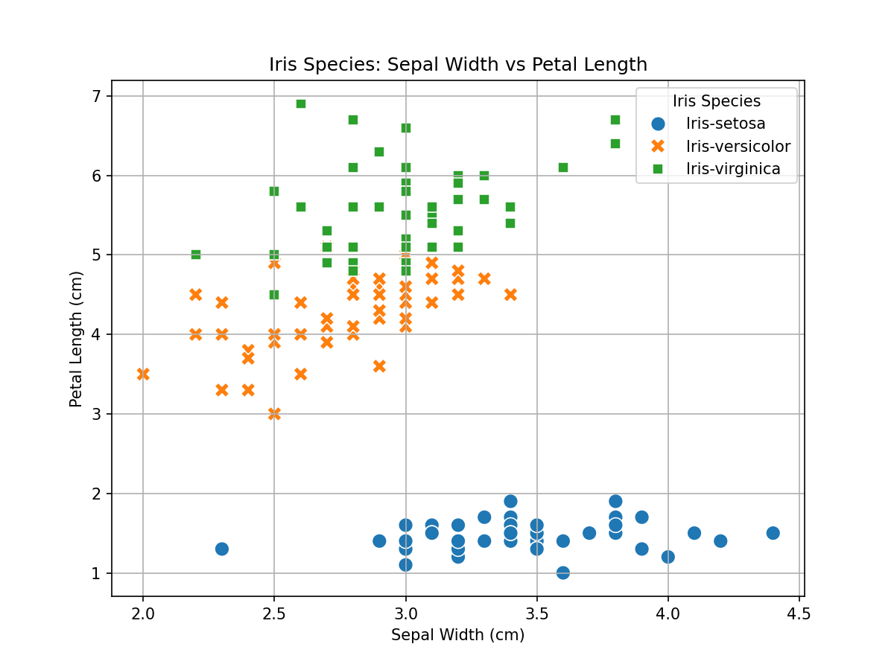
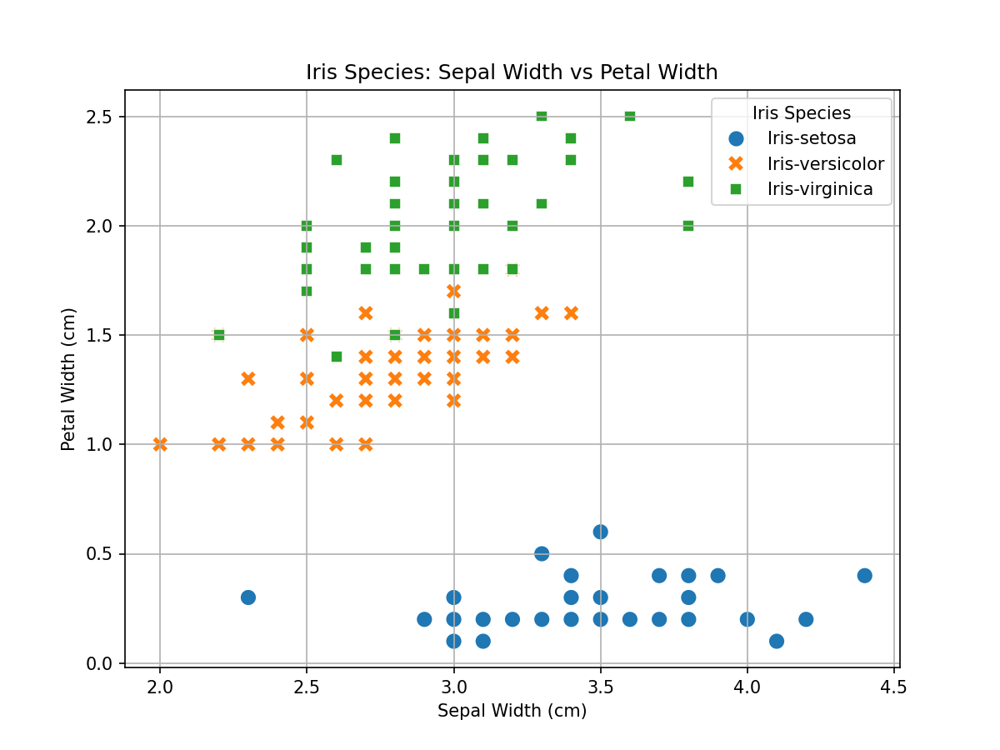

**Team Members:**  
- Mr J

**Dataset Used:**
Iris Classification Dataset

**Source:**  
[UCI Iris Data](https://archive.ics.uci.edu/dataset/53/iris)</br>
[Import ReadMe for Data](https://github.com/uci-ml-repo/ucimlrepo)

**Target Variable (What we are predicting):**  
Predicted Attribute: Class of Iris Plant
 - Setosa, Versicolour, or Virginica

**Features Considered:**  
- Sepal Length
- Petal Length
- Sepal Width
- Petal Width

**[Video Review](https://youtu.be/dQw4w9WgXcQ)**

## Getting Started






## Human Algorithm

### Pseudo-Code
```text
The clearest difference is iris classification is visible when sepal width is compared to petal width, so the human-algorithm is:

    IF petal_width < 0.6:
        Predict Setosa
    ELSE IF petal_width < 1.6:
        Predict Versicolor
    ELSE:
        Predict Virginica

```

When examining the data and visualizations, we focused on petal width only, because it appears that this measurement has the most distinction between species.

The plots/tables suggested a possible threshold for petal width, and we considered values above or below 0.6 and 1.6 to see how they might relate to species.

From the summary tables and visualizations, it appeared that sepal width could influence classification, which led us to using this factor in our decision rules.

### Confusion Matrix

Accuracy: 86.67%

| Actual \\ Predicted | Iris-setosa | Iris-versicolor | Iris-virginica |
|--------------------|-------------|------------------|----------------|
| **Iris-setosa**     | 14          | 1                | 0              |
| **Iris-versicolor** | 0           | 12               | 3              |
| **Iris-virginica**  | 0           | 2                | 13             |

One example where our algorithm worked well is when the inputs were clearly distinct, leading to a correct prediction of iris-setosa because the majority of these flowers had a petal length that was clearly shorter.

An example where the algorithm did not perform as expected is when the petal lengths overlapped, resulting in a prediction of versicolor instead of virginica or vice-versa in a few cases. Specifically, a flower with a sepal width of 2.8mm and petal width of 1.5mm was classified by our algorithm as Iris-versicolor but should have been labeled as Iris-virginica.

These examples of success and failure highlight patterns in the data or limitations in our rules, such as the fact that there are some flowers with petal lengths that didn't perfectly fit our classification algorithm.


## Machine Learning Model

We chose a value of k = ___ after comparing model performance across different values of k and observing that ___.

When analyzing the outputs and metrics, we noticed that changing k affected ___, which influenced our final choice.

Based on the results shown in the tables or visualizations, k = ___ best matched our goals for model performance because ___.

### Confusion Matrix

Accuracy: ?

| Actual \ Predicted | Class 1 | Class 2 | Class 3 |
|-------------------|---------|---------|---------|
| **Class 1**       |         |         |         |
| **Class 2**       |         |         |         |
| **Class 3**       |         |         |         |

The table/visualization shows a clear pattern where the model predicts ___ when ___, indicating a strong relationship between these features.

The confusion matrix reveals that the model most often confuses ___ with ___, suggesting these classes have similar feature values.

Compared to the human algorithm, the KNN model shows different behavior when ___, as seen in the ___ visualization.


